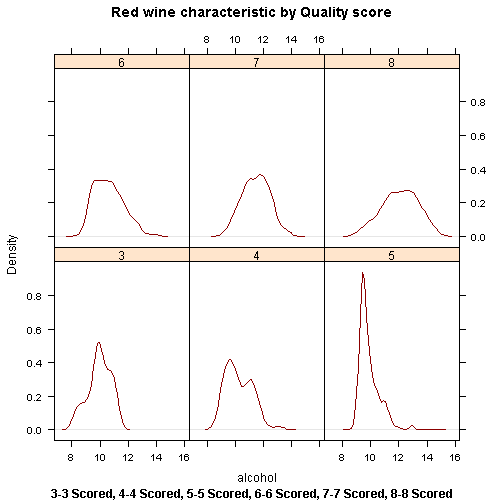
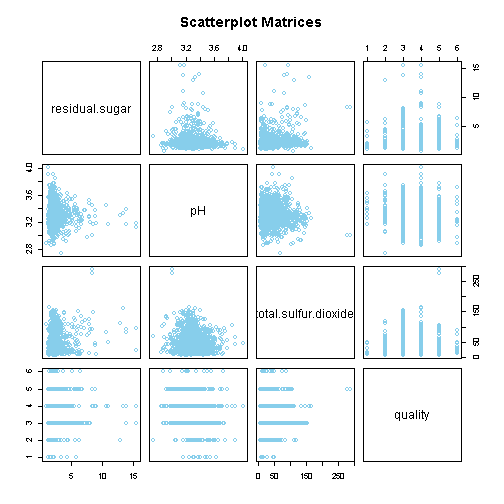

<style>
.small-code pre code {
  font-size: 1em;
}
.midcenter {
    position: fixed;
    left: 20%;
}
</style>
Exploring Red Wine characteristics and prediction model for quality of wine 
========================================================
author: Iriny Nisina
date: 31 January 2016

About the data
========================================================
The dataset for this project is public available for research. The details are described in [Cortez et al., 2009]. 
 - P. Cortez, A. Cerdeira, F. Almeida, T. Matos and J. Reis. 
   Modeling wine preferences by data mining from physicochemical properties.
 - In Decision Support Systems>, Elsevier, 47(4):547-553. ISSN: 0167-9236.
 - Available at: [@Elsevier] http://dx.doi.org/10.1016/j.dss.2009.05.016
                 [Pre-press (pdf)] http://www3.dsi.uminho.pt/pcortez/winequality09.pdf
                 [bib] http://www3.dsi.uminho.pt/pcortez/dss09.bib

Density Plot (for example alcohol by quality)
========================================================
class: midcenter




Pairs Plot (for example only 4 variables)
========================================================
class: midcenter


Summary for prediction model (linear regression)
========================================================
class: small-code

```r
    set.seed(12344)
    modFit <- train(as.numeric(quality)~., data = Data, method = "lm")
    modFit
```

```
Linear Regression 

1599 samples
  11 predictor

No pre-processing
Resampling: Bootstrapped (25 reps) 
Summary of sample sizes: 1599, 1599, 1599, 1599, 1599, 1599, ... 
Resampling results

  RMSE       Rsquared   RMSE SD    Rsquared SD
  0.6512856  0.3445858  0.0204763  0.02303368 

 
```
